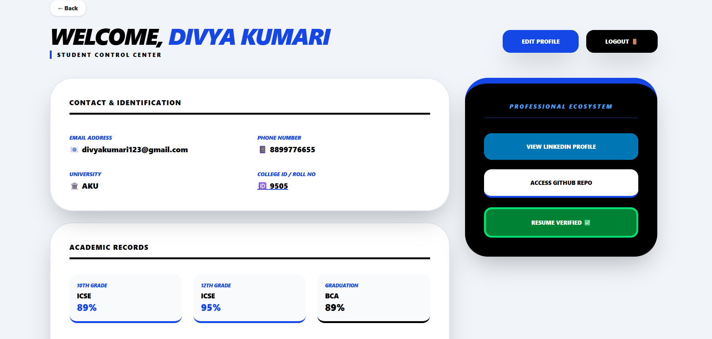
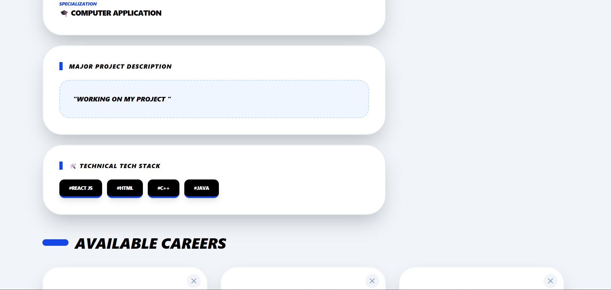
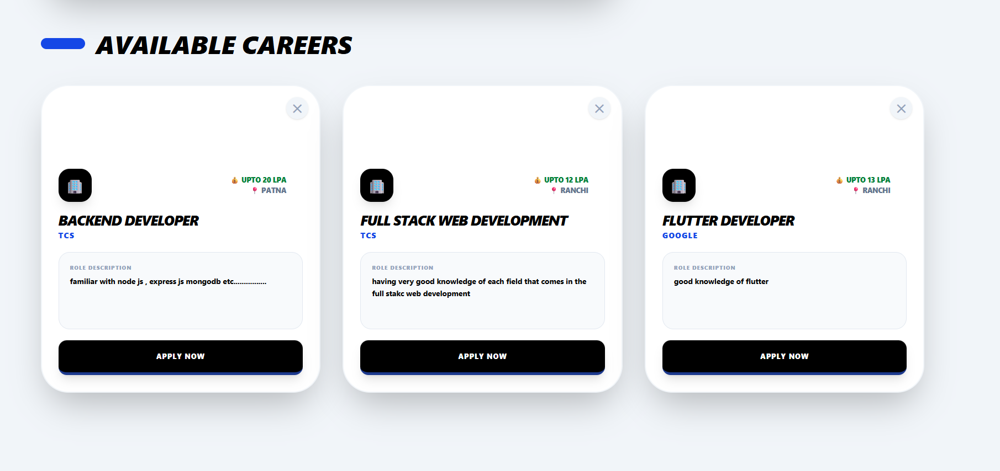
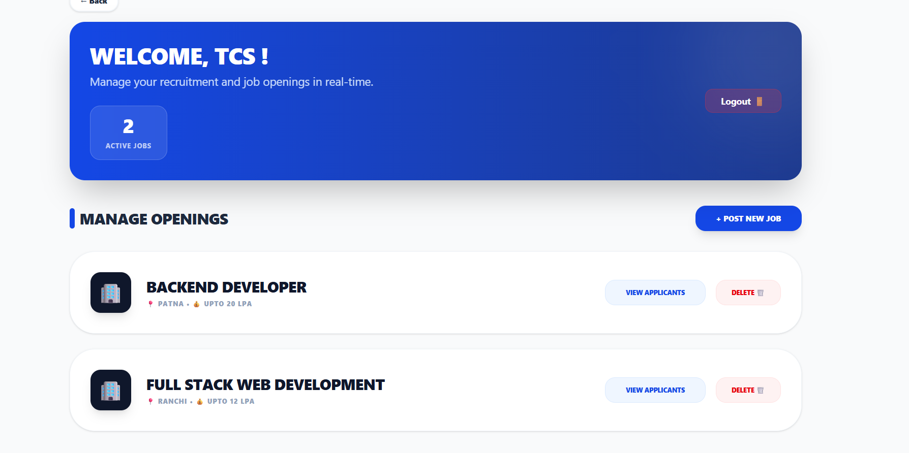
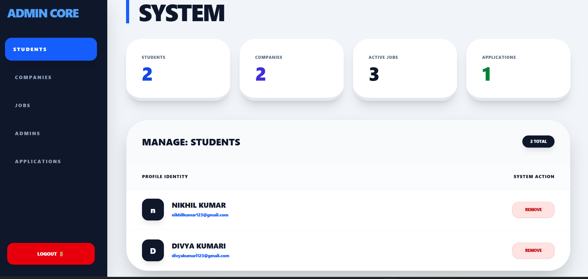

## Campus Hire project description

Campus Hire is a full-stack MERN web application developed to manage and streamline
the campus recruitment process. The platform provides three dedicated portals —
Student, Company, and Admin — each with role-based access and functionality.

Students can explore job opportunities, apply for positions, and upload resumes.
Companies can post job openings, view applications, and shortlist candidates.
Admins oversee the entire system by managing users, job postings, and recruitment activities.

This project is designed to replicate a real-world campus hiring workflow and
demonstrates practical implementation of authentication, authorization, and
role-based access control using the MERN stack.

## 🚀 Features

### 👨‍🎓 Student Portal

- Student registration & login
- View available job opportunities
- Apply for jobs
- Upload resume
- Track application status

### 🏢 Company Portal

- Company registration & login
- Post job openings
- View student applications
- Shortlist candidates

### 🛠 Admin Portal

- Admin login
- Manage students and companies
- Monitor job postings
- Oversee recruitment activities

## 📸 Project Screenshots

### 🌐 Landing Page

This is the landing page where users can choose their role and proceed to login.

---

### 👨‍🎓 Student Portal – Dashboard

Students can view job opportunities, apply for jobs, upload resumes, and track application status.

---

### 🏢 Company Portal – Dashboard

Companies can post job openings, view student applications, and shortlist candidates.

---

### 🛠 Admin Portal – Dashboard

Admins manage students, companies, job postings, and oversee the entire recruitment system.

